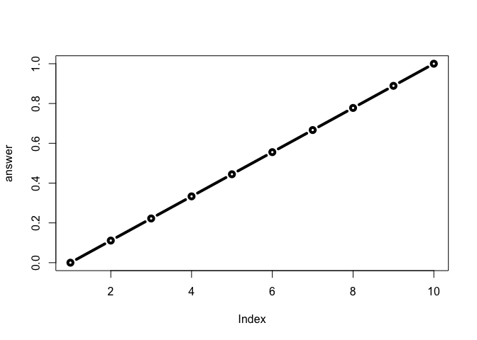
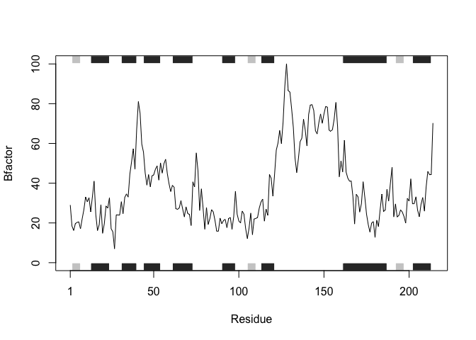

Basic R Funtions
================
Jiawei
10/18/2019

# This is a H1

This is my class 6 work

## A H2

### A level 3 heading H3

``` r
read.table("test1.txt", sep=",", header=TRUE)
```

    ##   Col1 Col2 Col3
    ## 1    1    2    3
    ## 2    4    5    6
    ## 3    7    8    9
    ## 4    a    b    c

``` r
read.csv("test1.txt", sep=" ")
```

    ##   Col1.Col2.Col3
    ## 1          1,2,3
    ## 2          4,5,6
    ## 3          7,8,9
    ## 4          a,b,c

First Function

``` r
add <- function(x, y=1) {
# Sum the input x and y
x + y
}
```

``` r
add(c(5,6))
```

    ## [1] 6 7

``` r
add(5, 5)
```

    ## [1] 10

``` r
add(5, nchar("first"))
```

    ## [1] 10

A Second Function

``` r
rescale <- function(x) {
 rng <-range(x)
 (x - rng[1]) / (rng[2] - rng[1])
}
```

``` r
rescale(1:10)
```

    ##  [1] 0.0000000 0.1111111 0.2222222 0.3333333 0.4444444 0.5555556 0.6666667
    ##  [8] 0.7777778 0.8888889 1.0000000

``` r
rescale( c(1,2,NA,3,10) ) #because the output of range(x) is NA NA
```

    ## [1] NA NA NA NA NA

``` r
x <- c(1,2,NA,3,10)
range(x, na.rm = TRUE)
```

    ## [1]  1 10

``` r
rescale2 <- function(x) {
 rng <-range(x, na.rm=TRUE)
 (x - rng[1]) / (rng[2] - rng[1])
}
```

``` r
rescale2( c(1,2,NA,3,10) )
```

    ## [1] 0.0000000 0.1111111        NA 0.2222222 1.0000000

``` r
rescale3 <- function(x, na.rm=TRUE, plot=FALSE) {
if(na.rm) {
rng <-range(x, na.rm=na.rm)
} else {
rng <-range(x)
}
print("Hello")
answer <- (x - rng[1]) / (rng[2] - rng[1])
print("is it me you are looking for?")
if(plot) {
plot(answer, typ="b", lwd=4)
}
print("I can see it in ...")
}
```

``` r
rescale3(1:10)
```

    ## [1] "Hello"
    ## [1] "is it me you are looking for?"
    ## [1] "I can see it in ..."

``` r
rescale3(1:10, plot=TRUE)
```

    ## [1] "Hello"
    ## [1] "is it me you are looking for?"

<!-- -->

    ## [1] "I can see it in ..."

``` r
#install.packages("bio3d")
```

``` r
library(bio3d)

s1 <- read.pdb("4AKE")  # kinase with drug
```

    ##   Note: Accessing on-line PDB file

``` r
s2 <- read.pdb("1AKE")  # kinase no drug
```

    ##   Note: Accessing on-line PDB file
    ##    PDB has ALT records, taking A only, rm.alt=TRUE

``` r
s3 <- read.pdb("1E4Y")  # kinase with drug
```

    ##   Note: Accessing on-line PDB file

``` r
s1.chainA <- trim.pdb(s1, chain="A", elety="CA")
s2.chainA <- trim.pdb(s2, chain="A", elety="CA")
s3.chainA <- trim.pdb(s1, chain="A", elety="CA")

s1.b <- s1.chainA$atom$b
s2.b <- s2.chainA$atom$b
s3.b <- s3.chainA$atom$b
plotb3(s1.b, sse=s1.chainA, typ="l", ylab="Bfactor")
```

<!-- -->

``` r
plotb3(s2.b, sse=s2.chainA, typ="l", ylab="Bfactor")
```

<!-- -->

``` r
plotb3(s3.b, sse=s3.chainA, typ="l", ylab="Bfactor")
```

<!-- -->
