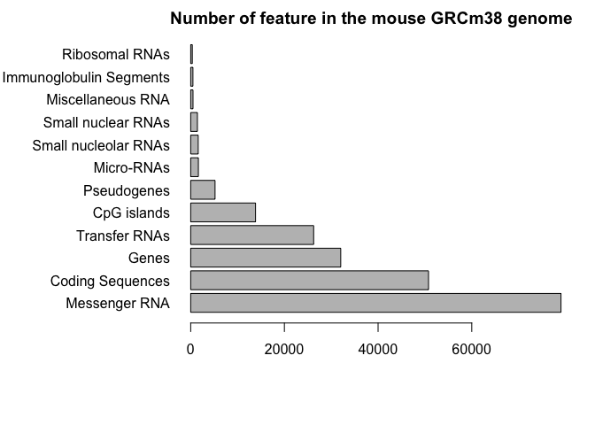

Data exploration and visualization in R
================

``` r
#Section 2
? read.table
weight <- read.table(file="bimm143_05_rstats/weight_chart.txt", 
                     header=TRUE)

plot(weight$Age, weight$Weight, typ="o", pch=15, cex=1.5, lwd=2, 
     ylim=c(2,10), xlab= "Age(month)", ylab="Weight (kg)",
    main="Babay weight with age")
```

<!-- -->

``` r
#Section 2C Barplot
mouse <- read.csv(file="bimm143_05_rstats/feature_counts.txt", header=TRUE,
                  sep="\t")


par(mar=c(6,11,2,2))
barplot(mouse$Count, horiz=TRUE, ylab="",
        names.arg = mouse$Feature,
        main="Number of feature in the mouse GRCm38 genome ", las=1)
```

<!-- -->

``` r
#Section 3A
section_3 <- read.csv(file="bimm143_05_rstats/male_female_counts.txt", header=TRUE,
                      sep="\t")
barplot(section_3$Count, xlab="", names.arg = section_3$Sample, las=2, ylab="Counts",
        col=rainbow(10))
```

<!-- -->

``` r
barplot(section_3$Count, xlab="", names.arg = section_3$Sample, las=2, ylab="Counts",
        col=c("blue2", "red2"))
```

<!-- -->

``` r
#Section 3B
genes <- read.delim(file="bimm143_05_rstats/up_down_expression.txt", header=TRUE)
nrow(genes)
```

    ## [1] 5196

``` r
palette(c("blue","gray","red"))
plot(genes$Condition1, genes$Condition2, col=genes$State,
     xlab="Expression condition 1", ylab="Expression level 2")
```

<!-- -->
