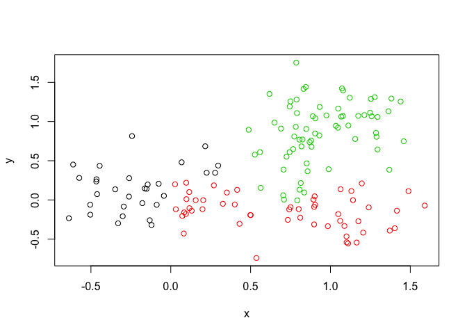

Machine Learning 1
================
Jiawei Xu
10/25/2019

## K-means example

we’ll make up some data for clustering

``` r
tmp <- c(rnorm(30,-3), rnorm(30,3))
x <- cbind(x=tmp, y=rev(tmp))

plot(x)
```

<!-- -->

``` r
k <- kmeans(x, centers=3, nstart=20)

k
```

    ## K-means clustering with 3 clusters of sizes 30, 24, 6
    ## 
    ## Cluster means:
    ##           x         y
    ## 1  2.991583 -3.056171
    ## 2 -3.420286  2.808517
    ## 3 -1.599708  3.723847
    ## 
    ## Clustering vector:
    ##  [1] 2 2 2 2 2 3 2 2 2 2 3 3 3 2 2 2 2 2 2 2 2 2 2 2 2 2 3 3 2 2 1 1 1 1 1
    ## [36] 1 1 1 1 1 1 1 1 1 1 1 1 1 1 1 1 1 1 1 1 1 1 1 1 1
    ## 
    ## Within cluster sum of squares by cluster:
    ## [1] 59.68941 32.99277  6.76544
    ##  (between_SS / total_SS =  91.8 %)
    ## 
    ## Available components:
    ## 
    ## [1] "cluster"      "centers"      "totss"        "withinss"    
    ## [5] "tot.withinss" "betweenss"    "size"         "iter"        
    ## [9] "ifault"

``` r
k$cluster
```

    ##  [1] 2 2 2 2 2 3 2 2 2 2 3 3 3 2 2 2 2 2 2 2 2 2 2 2 2 2 3 3 2 2 1 1 1 1 1
    ## [36] 1 1 1 1 1 1 1 1 1 1 1 1 1 1 1 1 1 1 1 1 1 1 1 1 1

``` r
table(k$cluster)
```

    ## 
    ##  1  2  3 
    ## 30 24  6

``` r
k$centers
```

    ##           x         y
    ## 1  2.991583 -3.056171
    ## 2 -3.420286  2.808517
    ## 3 -1.599708  3.723847

``` r
plot(x, col=k$cluster)
points(k$centers, col="blue", pch=15)
```

<!-- -->

# Hierarchical Clustering in R

``` r
hc <- hclust(dist(x))
hc
```

    ## 
    ## Call:
    ## hclust(d = dist(x))
    ## 
    ## Cluster method   : complete 
    ## Distance         : euclidean 
    ## Number of objects: 60

# plot my results

``` r
plot(hc)

abline(h=6, col="red")
abline(h=4, col="blue")
```

<!-- -->

``` r
grps <- cutree(hc, h=4)
table(grps)
```

    ## grps
    ##  1  2  3  4  5  6 
    ##  4 17  9  9  4 17

``` r
grps <- cutree(hc, k=3)
```

``` r
plot(x, col=grps)
```

<!-- -->

``` r
# Step 1. Generate some example data for clustering
x <- rbind(
matrix(rnorm(100, mean=0, sd = 0.3), ncol = 2), # c1
matrix(rnorm(100, mean = 1, sd = 0.3), ncol = 2), # c2
matrix(c(rnorm(50, mean = 1, sd = 0.3), # c3
rnorm(50, mean = 0, sd = 0.3)), ncol = 2))
colnames(x) <- c("x", "y")
```

``` r
# Step 2. Plot the data without clustering
plot(x)
```

<!-- -->

``` r
# Step 3. Generate colors for known clusters
# (just so we can compare to hclust results)
col <- as.factor( rep(c("c1","c2","c3"), each=50) )
plot(x, col=col)
```

<!-- -->

``` r
hc1 <- hclust(dist(x))
grps2 <- cutree(hc1, k=3)
plot(x, col=grps2)
```

<!-- -->

``` r
mydata <- read.csv("https://tinyurl.com/expression-CSV",
row.names=1)
head(mydata)
```

    ##        wt1 wt2  wt3  wt4 wt5 ko1 ko2 ko3 ko4 ko5
    ## gene1  439 458  408  429 420  90  88  86  90  93
    ## gene2  219 200  204  210 187 427 423 434 433 426
    ## gene3 1006 989 1030 1017 973 252 237 238 226 210
    ## gene4  783 792  829  856 760 849 856 835 885 894
    ## gene5  181 249  204  244 225 277 305 272 270 279
    ## gene6  460 502  491  491 493 612 594 577 618 638

``` r
nrow(mydata)
```

    ## [1] 100

``` r
ncol(mydata)
```

    ## [1] 10

``` r
pca <- prcomp(t(mydata), scale=TRUE)

## See what is returned by the prcomp() function
attributes(pca)
```

    ## $names
    ## [1] "sdev"     "rotation" "center"   "scale"    "x"       
    ## 
    ## $class
    ## [1] "prcomp"

``` r
# $names
#[1] "sdev" "rotation" "center" "scale" "x"
#
# $class
#[1] "prcomp"

plot(pca$x[,1], pca$x[,2])
```

<!-- -->

``` r
summary(pca)
```

    ## Importance of components:
    ##                           PC1    PC2     PC3     PC4     PC5     PC6
    ## Standard deviation     9.6237 1.5198 1.05787 1.05203 0.88062 0.82545
    ## Proportion of Variance 0.9262 0.0231 0.01119 0.01107 0.00775 0.00681
    ## Cumulative Proportion  0.9262 0.9493 0.96045 0.97152 0.97928 0.98609
    ##                            PC7     PC8     PC9      PC10
    ## Standard deviation     0.80111 0.62065 0.60342 3.348e-15
    ## Proportion of Variance 0.00642 0.00385 0.00364 0.000e+00
    ## Cumulative Proportion  0.99251 0.99636 1.00000 1.000e+00

``` r
plot(pca)
```

<!-- -->

``` r
plot(pca$x[,1:2], col=c("red", "red", "red", "red", "red", "blue","blue", "blue", "blue", "blue"))
```

<!-- -->

``` r
#inclass lab
x <- read.csv("UK_foods.csv", row.names=1)
rownames(x) <- x[,1]

head(x)
```

    ##     England Wales Scotland N.Ireland
    ## 105     105   103      103        66
    ## 245     245   227      242       267
    ## 685     685   803      750       586
    ## 147     147   160      122        93
    ## 193     193   235      184       209
    ## 156     156   175      147       139

``` r
barplot(as.matrix(x), beside=T, col=rainbow(nrow(x)))
```

<!-- -->
